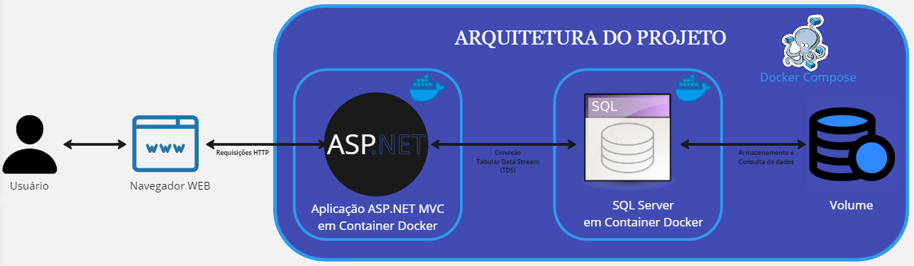

# Gestão de Alunos

## Sumário

1. [Tecnologias Utilizadas](#tecnologias-utilizadas)
2. [Arquitetura](#arquitetura)
3. [Dependências](#dependências)
4. [Modo de Uso](#modo-de-uso)
5. [Descrição das Páginas](#descrição-das-páginas)

## Tecnologias Utilizadas

- ASP.NET MVC
- SQL Server
- Docker
- Docker-Compose

## Arquitetura



## Dependências

Para rodar este projeto, você vai precisar:

- Docker Desktop configurado para rodar containers Windows:

    Para instalar o Docker Desktop, visite o [site oficial do Docker](https://www.docker.com/products/docker-desktop/) e clique em "Download". Após baixar o instalador, execute-o e siga as instruções na tela. Lembre-se de configurar o Docker Desktop para rodar containers Windows, que pode ser feito acessando as configurações do Docker Desktop e selecionando a opção "Switch to Windows containers...".

- SDK Microsoft para .NET Framework 4.7:

    Para baixar o SDK, você pode acessar a [página oficial da Microsoft](https://dotnet.microsoft.com/pt-br/download/dotnet-framework/net47). Siga as instruções na tela para instalar.

(opcional caso queira mexer no código):
- Visual Studio :

    A instalação do Visual Studio é opcional e apenas necessária se você deseja editar o código. Para instalá-lo, visite o [site oficial da Microsoft](https://visualstudio.microsoft.com/pt-br/downloads/) e clique em "Download Visual Studio". Siga as instruções na tela para instalar.

- Runtime Microsoft compatível com o .NET Framework 4.7:
    Runtime do .NET Framework 4.7, [página oficial da Microsoft](https://dotnet.microsoft.com/pt-br/download/dotnet-framework/net47). Siga as instruções na tela para instalar.


## Modo de Uso

Abra o terminal e utilize o comando:

```bash
git clone https://github.com/Inoxybel/CP3-DevOps-3Sem
```

Após a conclusão, navegue até a pasta CP3-DevOps-3Sem:

```bash
cd .\CP3-DevOps-3Sem\

```

e execute o comando:
```bash
docker-compose up
```
Aguarde a conclusão. Depois, acesse o link: http://localhost:8000/

## Descrição das Páginas
A página cadastrar serve para criar um novo cadastro. Os campos pedidos são: email, cpf, senha.

A página de login é para logar no sistema.

A página de perfil é para gerenciar as informações do seu cadastro.

A página alunos é para o gerenciamento de alunos:

A página cadastrar alunos deve ser preenchidas com os campos: nome, email, cpf, descrição (não obrigatória), ativo.

A página remover aluno é para excluir o cadastro do aluno.

A página editar aluno é para editar as informações cadastradas do aluno.

Os dados armazenados no banco são acessíveis para todos que tiverem acesso a página de alunos, porém o gerenciamento deles só pode ser feito através de um usuário logado.